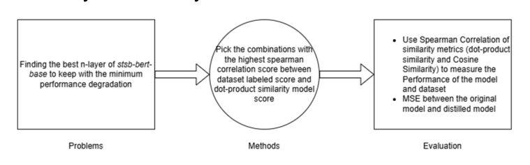

# CombiBERT — n-layer-distillation

> Reference implementation for the paper
> **CombiBERT: Choosing the Best Layers Combination in Sentence-BERT Model Variant to Reduce Losses in Knowledge Distillation** — Willy Lau, Sani Muhamad Isa (Binus Graduate Program, Jakarta).
> Published in IEEE Xplore: [ieeexplore.ieee.org/document/11290133](https://ieeexplore.ieee.org/document/11290133)
> · Full paper (local copy): [`docs/CombiBERT.pdf`](docs/CombiBERT.pdf)

This repository holds the notebooks behind the CombiBERT research: a **brute-force
combinatorial layer-reduction** method for distilling Sentence-BERT models, plus a
downstream **SNN-CNN hybrid** duplicate-question classifier used to test the distilled
encoders.

The core idea: a 12-layer transformer teacher is compressed into a smaller student that
keeps only a carefully chosen *n* of the 12 encoder layers. Instead of guessing which
layers to keep, CombiBERT **exhaustively evaluates every `C(12, n)` combination** on
STS-B, selects the subset with the highest Spearman correlation, and then **MSE-distills**
that pruned student to reproduce the teacher's embeddings — recovering near-teacher
semantic quality at roughly half the parameters.

---

## Abstract (from the paper)

BERT's deep 12–24 layer architecture is costly to deploy in real-time and
resource-constrained settings. CombiBERT introduces an alternative layer-reduction
approach that uses **brute-force combinatorics** to select which encoder layers to
retain while minimizing knowledge-distillation loss on a Sentence-BERT variant.
Experiments on the 12-layer `stsb-bert-base` model (datasets: All-NLI, Wikipedia,
STS Benchmark; metrics: MSE and Spearman correlation of cosine similarity) identified:

- a **6-layer** model `[0, 5, 7, 9, 10, 11]` — lowest MSE **0.019820**, Spearman
  within **0.54%** of the teacher;
- a **4-layer** model `[0, 4, 10, 11]` — MSE **0.040428**, Spearman within **1.12%**
  of the teacher (best efficiency/performance balance).

The method offers a practical path to deploying BERT in recommendation engines and
semantic-search tools without significant performance loss.

**Keywords:** Layer Reduction, Model Compression, Knowledge Distillation, BERT, Sentence-BERT.

---

## Research hypothesis

Early distillation experiments showed that the layer combinations producing the best
Spearman correlation *always contained both layer 10 and layer 11* — suggesting some
layers are far more critical than others, and that an optimal *n*-layer subset exists.



---

## Method at a glance

```
Teacher (stsb-bert-base, 12 layers)
        │
        │  (1) brute-force layer-combination search on STS-B  (C(12,n) subsets)
        ▼
Pick best n-layer subset  →  6L [0,5,7,9,10,11]   or   4L [0,4,10,11]   (stsb-bert-base)
                             6L [0,1,7,9,10,11]    or   4L [0,7,10,11]   (stsb-roberta-base-v2)
        │
        │  (2) build student = teacher with only those layers kept
        │  (3) MSE-distill student against teacher embeddings
        │      (All-NLI + Wikipedia, ~9.1M sentence pairs; teacher embeddings = gold labels)
        ▼
Distilled student encoder  (≈ half the parameters)
        │
        │  (4) evaluate vs teacher on STS-B (Spearman cosine/dot, MSE)
        │  (5) freeze as feature extractor
        ▼
SNN-CNN hybrid classifier  →  Quora duplicate-question detection
```

### Distillation methodology


---

## Repository layout / run order

The notebooks are numbered to reflect the intended execution order.

| Order | File | Purpose |
|------|------|---------|
| 1 | `1.Check Best Layer Combination Model/Combination_LayerList.ipynb` | Original layer-combination search. Enumerates all `C(12,4)` (or `C(12,6)`) subsets, prunes the teacher to each, evaluates on STS-B dev, dumps `Combination_Layer_Results.xlsx`. |
| 1A | `1.Check Best Layer Combination Model/1A.Combination_LayerList_New.ipynb` | Updated search using the HF `datasets` STS-B split and the newer `EmbeddingSimilarityEvaluator`, with GPU cleanup between combinations. Saves `Combination_6Layer_Results_*.xlsx`. |
| 1B | `1.Check Best Layer Combination Model/1B.Check_best_model.ipynb` | Loads a results spreadsheet and sorts by `spearman_dot` to pick the best subset. |
| 2 | `2.Teacher_Embeddings.ipynb` | Generates distillation training data: encodes All-NLI + Wikipedia with the teacher and saves teacher embeddings as gold labels to `datasets/distillation_*_dataset_*`. |
| 3A | `3A.Distillation_Layer_Reduction.ipynb` | Builds the pruned student and MSE-distills it against the precomputed teacher embeddings. Saves to `distilled/model-distillation-<timestamp>/final`. |
| 3B | `3B.Distillation_Layer_Reduction_Continue.ipynb` | Resumes distillation from a saved checkpoint on the next data shard (full ~9M corpus trained in chunks). |
| 4 | `4.Model_Evaluation.ipynb` | Compares teacher vs distilled students on STS-B (Spearman), reports teacher↔student embedding MSE and trainable-parameter counts. |
| — | `SNN-Dense_Hybrid.ipynb` | Downstream task: the SNN-CNN hybrid classifier for Quora duplicate-question detection, using the (teacher or distilled) encoder as a frozen feature extractor. |

---

## Datasets (from the paper)

| Dataset | Role | Notes |
|---------|------|-------|
| **All-NLI** (SNLI + MNLI) | distillation training | pre-split; dedup then encoded with the teacher |
| **Wikipedia** (en sentences) | distillation training | manually split (5000 held out for dev); dedup then encoded |
| **STS Benchmark** | evaluation only | 1500 dev samples; Spearman correlation of similarity |
| **Quora Question Pairs** | downstream classification | 404,290 pairs; `is_duplicate` binary label |

- **Train corpus:** All-NLI train + Wikipedia train concatenated ≈ **9.1M sentence pairs**.
- **MSE eval set:** 5000 Wikipedia dev + 5000 All-NLI dev = **10,000 samples**.
- **Quora balancing:** minority class (`is_duplicate=1`) upsampled with
  `sklearn.utils.resample` to match the majority → **510,084 entries**, then an 80/20
  split (**408,067 train / 102,017 test**).

---

## Results (from the paper)

### stsb-bert-base — MSE vs distilled models (Table I)

MSE values scaled ×100; lower is better.

| Layer combination | MSE (×100) | Trainable params |
|---|---|---|
| Teacher (stsb-bert-base) | — | 109,482,240 |
| `[1, 4, 7, 10]` | 4.5102 | 52,779,264 |
| `[1, 5, 9, 11]` | 3.2838 | 52,779,264 |
| `[2, 4, 8, 10]` | 4.5223 | 52,779,264 |
| **`[0, 4, 10, 11]`** (combination method) | **3.0631** | 52,779,264 |
| Odd layers `(1,3,5,…)` | 3.7573 | 66,955,008 |
| Even layers `(0,2,4,…)` | 2.3752 | 66,955,008 |
| **`[0, 5, 7, 9, 10, 11]`** (combination method) | **1.9820** | 66,955,008 |

### stsb-bert-base — Spearman correlation (Table II, closer to 1 is better)

| Layers | Cosine | Dot-product |
|---|---|---|
| Teacher (stsb-bert-base) | 0.8704 | 0.8461 |
| `[1, 4, 7, 10]` | 0.8590 | 0.8242 |
| `[1, 5, 9, 11]` | 0.8606 | 0.8326 |
| `[2, 4, 8, 10]` | 0.8581 | 0.8223 |
| **`[0, 4, 10, 11]`** (combination) | 0.8606 | 0.8327 |
| Odd layers | 0.8653 | 0.8309 |
| Even layers | 0.8648 | 0.8382 |
| **`[0, 5, 7, 9, 10, 11]`** (combination) | 0.8657 | 0.8393 |

**Key finding:** the **even-layer** combination (MSE ×100 = 2.3752) clearly beats the
**odd-layer** one (3.7573), and any subset containing **layers 10 and 11** outperforms
subsets that omit them — not all layers contribute equally.

### stsb-roberta-base-v2 — MSE (Table III) & Spearman (Table IV)

| Layer combination | MSE (×100) | Trainable params | Cosine | Dot-product |
|---|---|---|---|---|
| Teacher (stsb-roberta-base-v2) | — | 124,645,632 | 0.8965 | 0.8544 |
| **`[0, 7, 10, 11]`** (4L) | 4.2804 | 67,942,656 | 0.8883 | 0.8469 |
| **`[0, 1, 7, 9, 10, 11]`** (6L) | 2.6779 | 82,118,400 | 0.8955 | 0.8553 |

The 6L RoBERTa student's cosine similarity differs from the teacher by only **0.11%**
(the 6L model was trained on ~4.5M samples, since MSE rose beyond that point).

### Quora Question Pairs — downstream classification (30 epochs)

**Distilled 6L stsb-RoBERTa-base-v2 as feature extractor (Table V):**

| Class | Precision | Recall | F1 |
|---|---|---|---|
| 0 (Not Duplicate) | 0.9347 | 0.8773 | 0.9051 |
| 1 (Duplicate) | 0.8843 | 0.9386 | 0.9107 |
| **Accuracy** | | | **0.9079** |

**Teacher stsb-RoBERTa-base-v2 as feature extractor (Table VI):**

| Class | Precision | Recall | F1 |
|---|---|---|---|
| 0 (Not Duplicate) | 0.9321 | 0.8876 | 0.9093 |
| 1 (Duplicate) | 0.8927 | 0.9353 | 0.9135 |
| **Accuracy** | | | **0.9115** |

The distilled model trails the teacher by only **0.36%** accuracy, and actually beats
it on duplicate recall and non-duplicate precision — confirming distillation preserves
downstream performance with a much lighter encoder.

---

## Requirements

Per the paper's setup: Ubuntu (WSL2), AMD Ryzen 5 3600, **NVIDIA RTX 3060 12GB**,
32GB RAM, Python 3.12. `sentence-transformers 3.1`, `PyTorch 2.4.1` (CUDA 12.4),
`transformers 4.42.2`. See `requirements.txt`. A CUDA GPU is strongly recommended
(the notebooks use fp16 and `torch.cuda`).

> You manage your own Python interpreter and environment. Install the dependencies into
> your environment of choice (e.g. your conda env) before running the notebooks.

## Data layout

The notebooks expect a local `datasets/` directory (not committed — see `.gitignore`):

- `datasets/stsbenchmark.tsv.gz` — for the original search notebook.
- `datasets/questions.csv` — Quora Question Pairs (`id`, `qid1`, `qid2`, `question1`,
  `question2`, `is_duplicate`).
- `datasets/distillation_train_dataset_*`, `datasets/distillation_evaluation_dataset_*` —
  produced by notebook 2.
- All-NLI / Wikipedia / STS-B splits are pulled on demand via HuggingFace `datasets`.

Distilled checkpoints land under `distilled/model-distillation-<timestamp>/final`.

## Typical workflow

```
# 1. find promising layer subsets
run  1.Check Best Layer Combination Model/1A.Combination_LayerList_New.ipynb
run  1.Check Best Layer Combination Model/1B.Check_best_model.ipynb
# 2. build distillation targets (teacher embeddings)
run  2.Teacher_Embeddings.ipynb
# 3. distil the pruned student (optionally continue on later shards)
run  3A.Distillation_Layer_Reduction.ipynb
run  3B.Distillation_Layer_Reduction_Continue.ipynb   # optional, next shard
# 4. compare teacher vs distilled students
run  4.Model_Evaluation.ipynb
# 5. (optional) downstream duplicate-question classifier
run  SNN-Dense_Hybrid.ipynb
```

## Documentation

- `docs/CombiBERT.pdf` — the full published paper (local copy of the IEEE Xplore article).
- `docs/ARCHITECTURE.md` — deep technical reference: pruning mechanics, distillation
  objective, BERT-layer decomposition, and the SNN-CNN hybrid classifier, with all
  paper figures.
- `docs/figures/` — figures extracted from the published paper.

## Citation

```bibtex
@inproceedings{lau_combibert,
  title     = {CombiBERT: Choosing the Best Layers Combination in Sentence-BERT
               Model Variant to Reduce Losses in Knowledge Distillation},
  author    = {Lau, Willy and Isa, Sani Muhamad},
  publisher = {IEEE},
  note      = {IEEE Xplore document 11290133},
  url       = {https://ieeexplore.ieee.org/document/11290133}
}
```

> The full paper is included in this repo at [`docs/CombiBERT.pdf`](docs/CombiBERT.pdf).

## Limitations & future work (from the paper)

- The brute-force method is **not recommended for encoders with more than 12 layers** —
  combinatorial cost grows too fast.
- STS-B is a controlled benchmark; real-world data may behave differently.
- Future directions: evaluate in recommendation systems / sentiment analysis / search
  ranking; explore **adaptive layer selection** (activate layers dynamically by task
  complexity or device limits).
