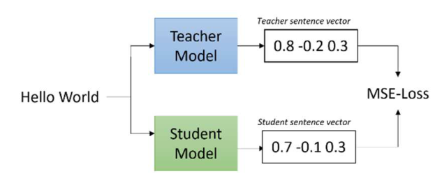

# Architecture & Design Notes

Deeper technical reference for **CombiBERT** / `n-layer-distillation`.
See `../README.md` for the overview, results tables, and run order.

> Paper: *CombiBERT: Choosing the Best Layers Combination in Sentence-BERT Model Variant
> to Reduce Losses in Knowledge Distillation* — Willy Lau, Sani Muhamad Isa.
> IEEE Xplore: [ieeexplore.ieee.org/document/11290133](https://ieeexplore.ieee.org/document/11290133)
> · Full paper (local copy): [`CombiBERT.pdf`](CombiBERT.pdf)

---

## 1. What one Sentence-BERT layer looks like

Each of the 12 encoder layers in `stsb-bert-base` is a standard Transformer encoder
block: WordPiece embeddings feed Key/Query/Value projections, scaled dot-product
attention, concatenation, then a feed-forward stack (768 → 3072 → 768 with GELU and
layer normalization). The final 768-d output serves as the sentence embedding.


---

## 2. Layer pruning mechanics

A Sentence-Transformer wraps a HuggingFace transformer, reachable as:

```python
auto_model = model._first_module().auto_model   # the underlying (Ro)BERTa
auto_model.encoder.layer                         # ModuleList of 12 encoder layers
```

Pruning keeps a chosen subset and rewrites the config so downstream code (and any
re-save) treats the model as an *n*-layer network:

```python
layers_to_keep = [0, 5, 7, 9, 10, 11]            # best 6-layer subset (stsb-bert-base)
new_layers = torch.nn.ModuleList(
    [m for i, m in enumerate(auto_model.encoder.layer) if i in layers_to_keep]
)
auto_model.encoder.layer = new_layers
auto_model.config.num_hidden_layers = len(layers_to_keep)
```

The kept layers retain their pretrained weights, so a freshly pruned model already
performs reasonably — but dropping layers breaks the residual stream, so distillation
is needed to re-align the student's output embeddings with the teacher's.

### Brute-force combinatorial search

For the 12-layer model the number of size-*n* subsets is the binomial coefficient
`C(12, n)`:

- `n = 4` → **495** combinations
- `n = 6` → **924** combinations

Every *untrained* pruned combination is scored on the STS-B dev set by the **Spearman
correlation of dot-product similarity** (dot-product is the unnormalized form of cosine;
Spearman is used because STS-B relationships are non-linear). The subset with the highest
score is selected for distillation. This exhaustive search **guarantees** the optimal
subset is found and reveals the relative importance of individual layers — at high
compute cost, which is why the paper notes it is unsuitable for encoders with >12 layers.

**Empirical takeaways:** the best subsets always contain **layers 10 and 11**; even-layer
subsets beat odd-layer ones. Best found: 6L `[0,5,7,9,10,11]` and 4L `[0,4,10,11]` for
`stsb-bert-base`; 6L `[0,1,7,9,10,11]` and 4L `[0,7,10,11]` for `stsb-roberta-base-v2`.

---

## 3. Distillation objective

The student is trained to **reproduce the teacher's embedding vectors** (representation
distillation), not to solve STS directly.



- Notebook 2 encodes All-NLI + Wikipedia (~9.1M pairs) with the teacher and stores each
  teacher embedding as the `label`.
- Notebook 3 trains the pruned student with `losses.MSELoss`, minimizing
  `‖student_embed(s) − teacher_embed(s)‖²`.

The student inherits the teacher's whole embedding geometry, so it transfers to any
downstream cosine/dot task the teacher was good at.

### Training configuration (paper)

| Param | Value |
|-------|-------|
| Trainer | `SentenceTransformerTrainer` |
| Epochs | 3 |
| Batch size | 64 (paper) / 32 (notebooks) |
| Learning rate | 1e-5 |
| Optimizer | Adam |
| Warmup ratio | 0.1 |
| Precision | fp16 |
| Checkpoint | every 3000 iterations |
| Eval | every 3000 iterations (paper) / 5000–7000 (notebooks) |

### Evaluation during training

A `SequentialEvaluator` runs two evaluators:
- `EmbeddingSimilarityEvaluator` on STS-B dev — Spearman/Pearson for cosine, dot,
  euclidean, manhattan.
- `MSEEvaluator(sentences, sentences, teacher_model=...)` — direct student↔teacher
  embedding MSE (the distillation-quality signal).

During training MSE drops sharply over the first ~2M samples, then plateaus. For the 6L
RoBERTa student, training was stopped at ~4.5M samples because MSE began rising beyond
that point.

### Sharded training

The ~9M-pair corpus is split into shards (`(0, 4507105)`, `(4507105, 9014210)`). `3A`
trains the first shard from the pruned teacher; `3B` reloads that checkpoint and
continues on the next shard, bounding peak memory and allowing resume after interruption.

---

## 4. Downstream classifier — SNN-CNN hybrid (`SNNHybridClassifier`)

A Siamese-Neural-Network + 1D-CNN hybrid over a **pair** of frozen 768-d embeddings,
for binary duplicate-question classification on Quora Question Pairs.


### Data flow

```
embedding1 (B,768)   embedding2 (B,768)
        └────── stack dim=1 ──────┘
                    │
             (B, 2, 768)
                    │  Conv1d(2→32, k=3, pad=1) + tanh
                    │  MaxPool1d(2)          → (B, 32, 384)
                    │  Conv1d(32→64, k=3, pad=1) + tanh
                    │  MaxPool1d(2)          → (B, 64, 192)
                    │  Flatten               → (B, 64*192)
                    │
     concat with cosine_similarity(e1, e2)   → (B, 64*192 + 1)
                    │  Linear → ReLU
                    │  Dropout(0.3)
                    │  Linear → ReLU
                    │  Linear(→2) → softmax
                    ▼
              class probabilities (duplicate / not)
```

### Design rationale (paper)

- **1D-CNN over stacked pairs:** treating the two embeddings as a 2-channel signal lets
  the network learn cross-dimension interactions between the pair, not just a flat concat.
  The convolutions *expand* representational complexity before the dense head.
- **tanh activation in the CNN:** its `(-1, 1)` output range matches both cosine
  similarity and the native BERT embedding range, so it preserves information. ReLU would
  clip negative values and destroy negatively-correlated features.
- **Explicit cosine-similarity feature:** injects the strong pairwise-similarity prior
  directly into the classifier, alongside the learned CNN features.
- **ReLU + 30% dropout in the dense head:** standard non-linearity and regularization.
- **Softmax + CrossEntropyLoss:** two output nodes for the binary decision; CE penalizes
  confident wrong predictions heavily.

### Data handling

- Source: `datasets/questions.csv` (Quora Question Pairs). Drops `id`, `qid1`, `qid2`;
  drops NaNs.
- Class imbalance fixed by upsampling the minority class with replacement to the majority
  size (`sklearn.utils.resample`, `random_state=42`), then shuffling. Final size 510,084;
  80/20 split → 408,067 train / 102,017 test.
- Embeddings precomputed once via `dataset.map(map_embeddings)` and stored with
  `set_format(type="torch", ...)`.

### Training loop

Custom PyTorch loop (`train_model`): Adam (lr 1e-4), CrossEntropyLoss, 30 epochs, batch
size 32; tracks train/val loss & accuracy per epoch, saves
`snn_classifier_hybrid_model.pth`, and plots loss/accuracy curves. Final evaluation uses
`classification_report` (4-digit) + confusion matrix.

### Results summary

Distilled 6L stsb-RoBERTa-base-v2 vs teacher (30 epochs): **90.79%** vs **91.15%**
accuracy — only **0.36%** lower. The distilled model even beats the teacher on duplicate
recall (0.9386 vs 0.9353) and non-duplicate precision (0.9347 vs 0.9321). See README
Tables V–VI for full precision/recall/F1 and confusion matrices.

---

## Reproducibility caveats

- Fixed seeds (42) are used for resampling and the train/test split, but the distillation
  Trainer and CUDA kernels are not fully deterministic.
- The exact distilled checkpoints referenced in notebook 4 (e.g.
  `...6L RoBERTa [0, 1, 7, 9, 10, 11]/`) are local artifacts and are not committed;
  regenerate them by running notebooks 2 → 3A → 3B.
- The paper trains at batch size 64; the committed notebooks use 32 (adjust to your VRAM).
